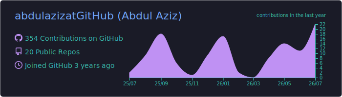
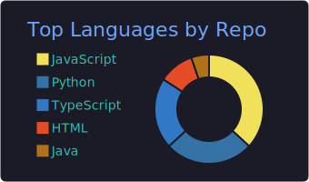
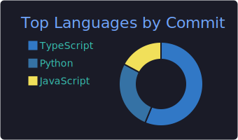
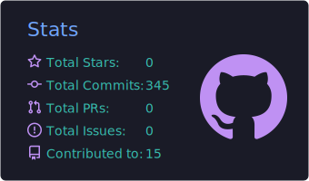
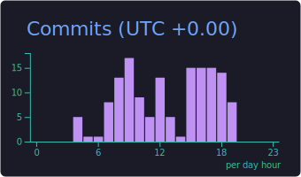

<!-- ============ BANNER ============ -->


<!-- ============ TYPING SUBTITLE ============ -->
<p align="center">
  <a href="https://github.com/abdulazizatGitHub">
    
  </a>
</p>

<!-- ============ SOCIAL ============ -->
<p align="center">
  <a href="https://www.linkedin.com/in/abdulaziz-dev"></a>
  <a href="https://abdulaziz-eta.vercel.app"></a>
  <a href="mailto:abdulazizk1430@gmail.com"></a>
</p>

<br/>

<!-- ============ ABOUT ============ -->
<table align="center">
<tr><td>

### About Me

Full-Stack Software Engineer who builds and ships modern web applications end to end — from responsive **React / Next.js** interfaces to **Node.js** and **Python / FastAPI** REST APIs over **PostgreSQL** and **MongoDB**.

```yaml
currently:   building PharmaCare — a pharmacy POS & inventory SaaS
strengths:   [ owning features end-to-end, API design, shipping via CI/CD ]
also_into:   integrating AI into real products (LLM agents), applied ML research
education:   MS Artificial Intelligence (in progress) · BS Software Engineering (3.52/4.0)
learning:    system design at scale, testing, cloud deployment
contact:     abdulazizk1430@gmail.com
```

</td></tr>
</table>

<br/>

<!-- ============ TECH STACK (reliable — skillicons.dev) ============ -->
<h3 align="center">Tech Stack</h3>

<p align="center"><b>Languages</b><br/>

</p>

<p align="center"><b>Frontend</b><br/>

</p>

<p align="center"><b>Backend &amp; Databases</b><br/>

</p>

<p align="center"><b>AI / ML &amp; DevOps</b><br/>

</p>

<br/>

<!-- ============ FEATURED PROJECTS ============ -->
<h3 align="center">Featured Projects</h3>

<table>
<tr>
<td width="50%" valign="top">

#### [PharmaCare](https://github.com/abdulazizatGitHub/pharma-care) &nbsp;`deployed`
Full pharmacy **POS & inventory** system — real-time KPI dashboard, typeahead checkout, expiry/low-stock tracking, CSV import, printable receipts.
<br/><br/>
  

</td>
<td width="50%" valign="top">

#### [GeoInsight](https://github.com/abdulazizatGitHub/geoinsight-store-locator) &nbsp;`deployed` · [Live Demo](https://geoinsight-store-locator.vercel.app)
Full-stack **Web-GIS** app — proximity search over PostgreSQL/**PostGIS**, FastAPI backend, React + Leaflet UI, shipped via GitHub Actions CI/CD.
<br/><br/>
  

</td>
</tr>
<tr>
<td width="50%" valign="top">

#### [InsightForge](https://github.com/abdulazizatGitHub/insight-forge)
Autonomous **multi-agent system** — async FastAPI + PostgreSQL backend, finite-state orchestrator, retry/fallback/rollback execution, full audit trail, Flutter client.
<br/><br/>
  

</td>
<td width="50%" valign="top">

#### [Laboratory Management System](https://github.com/abdulazizatGitHub)
Full-stack management system — role-based access control, JWT auth, REST APIs for inventory, staff, and scheduling.
<br/><br/>
  

</td>
</tr>
</table>

<br/>

<!-- ============ RESEARCH ============ -->
<h3 align="center">Research</h3>

<p align="center">
<b>ReMWGAN-FM: Reweighted Multi-Generator Wasserstein GAN with Feature Matching</b> — <i>First author, under review</i><br/>
A generative model for class-imbalanced network intrusion detection; improved macro-F1 over the prior baseline on UNSW-NB15.<br/>Led problem formulation, model design, and implementation.
</p>

<br/>

<!-- ============ GITHUB ACTIVITY (reliable — generated into this repo by Actions) ============ -->
<h3 align="center">GitHub Activity</h3>

<!--
  The images below are generated by GitHub Actions and committed INTO this repo,
  so they load as static files and do NOT rate-limit at view time.
  Set up: see the two workflow files in .github/workflows/
-->

<!-- Summary cards (generated by profile-summary-cards.yml into profile-summary-card-output/) -->
<p align="center">
  
</p>

<p align="center">
  
  
</p>

<p align="center">
  
  
</p>

<!-- Contribution snake (generated by snake.yml onto the 'output' branch) -->
<!-- Theme-aware: light-mode viewers see the white/green snake, dark-mode viewers see the dark one -->
<p align="center">
  <picture>
    <source media="(prefers-color-scheme: dark)" srcset="https://raw.githubusercontent.com/abdulazizatGitHub/abdulazizatGitHub/output/github-snake-dark.svg" />
    <source media="(prefers-color-scheme: light)" srcset="https://raw.githubusercontent.com/abdulazizatGitHub/abdulazizatGitHub/output/github-snake-light.svg" />
    
  </picture>
</p>

<br/>


